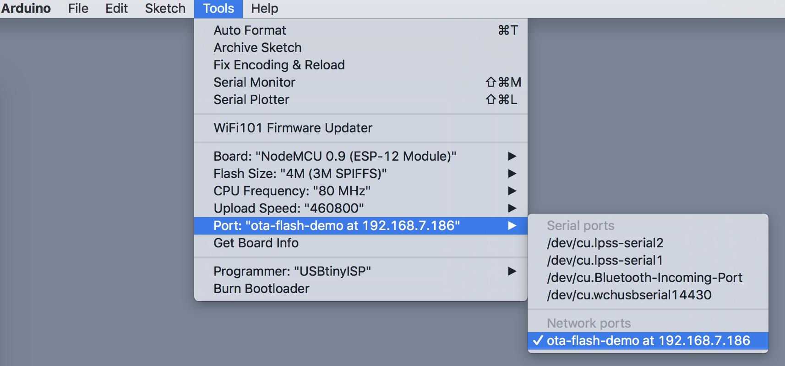

JeVe_EasyOTA library for Arduino
================================

# Installation

## Install as ZIP

* [Download ZIP file](https://github.com/jeroenvermeulen/JeVe_EasyOTA/archive/master.zip)
* Start the Arduino IDE
* Go to _Sketch > Include Library > Add .ZIP Library..._
* Select the ZIP file you just downloaded

## Install using Git (OSX / Linux)

* Open a terminal window
* Go to your Arduino libraries dir: `cd ~/Documents/Arduino/libraries`
* Execute: `git clone git@github.com:jeroenvermeulen/JeVe_EasyOTA.git`
* Restart your Arduino IDE

# Usage

The included examples are the easiest way to learn how to use this library.

After you put the code in your Arduino, after a few minutes you should see the OTA port in the Arduino IDE under the menu _Tools > Port_ 


## To include it in your own project:

Put on top of your Arduino file:
```
#include <JeVe_EasyOTA.h> 
EasyOTA OTA;
```

Put this in your `setup()` function. This example logs debugging output to Serial:
```
Serial.begin(9600);
// This callback will be called when JeVe_EasyOTA has anything to tell you.
OTA.onMessage([](char *message, int line) {
  Serial.println(message);
});
OTA.setup("wifi_ssid", "wifi_password", "arduino_hostname");
```

Put this in you `loop` function:
```
OTA.loop();
```

That's all folks.

# Problem Solving

## Port is not 